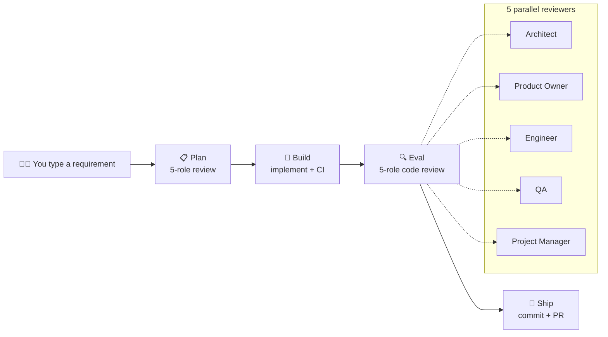

[中文](README.zh-CN.md)

# harness-flow

> **Cursor-native AI engineering framework** — plan, build, review, and ship with structured quality gates, all inside your IDE.

[](https://www.python.org/)
[](https://pypi.org/project/harness-flow/)
[](LICENSE)



---

## Quick Start

### 0. 10-minute happy path

```bash
pip install harness-flow
cd /path/to/your/project
harness init
```

Then open Cursor and type:

```
/harness-plan add input validation to the user registration endpoint
```

That's it. Harness plans, builds, reviews with 5 specialized roles, and ships a PR — all in one command.

<!-- TODO: Add a demo recording (GIF or video) showing the full flow from requirement to PR -->
<!-- TODO: Add a screenshot of the 5-role review output -->

---

## How it works

One requirement in, one PR out. Here's what happens inside:

```
/harness-plan "add feature X"
  → Plan with spec + contract
  → 5-role parallel review (architect, product-owner, engineer, QA, PM)
  → Build: implement + test
  → Eval: 5-role code review + Fix-First auto-remediation
  → Ship: bisectable commits + push + PR
```

**Fix-First** classifies every review finding before presenting it:
- **AUTO-FIX** — high certainty, small blast radius → fixed immediately
- **ASK** — security, behavior change, low confidence → presented to you

<details>
<summary><strong>5-role review details</strong> (graceful degradation — continues with available perspectives if some fail)</summary>

| Role                | Plan Review                                       | Code Review                                  |
| ------------------- | ------------------------------------------------- | -------------------------------------------- |
| **Architect**       | Feasibility, module impact, dependencies          | Conformance, layering, coupling, security    |
| **Product Owner**   | Vision alignment, user value, acceptance criteria | Requirement coverage, behavioral correctness |
| **Engineer**        | Implementation feasibility, code reuse, tech debt | Code quality, DRY, patterns, performance     |
| **QA**              | Test strategy, boundary values, regression risk   | Test coverage, edge cases, CI health         |
| **Project Manager** | Task decomposition, parallelism, scope            | Scope drift, plan completion, delivery risk  |

Findings from 2+ roles are flagged as **high confidence**. Each role can use a different model via `[native.role_models]` in config.

</details>

---

## All skills — default: `/harness-plan`

<details>
<summary><strong>Advanced entry points</strong></summary>

`/harness-brainstorm` is the long-horizon loop with roadmap/backlog; `/harness-vision` clarifies an incremental direction before planning; **`/harness-plan`** is the single-round plan → ship path.

| Skill                 | When to use            | What it does                                                                                 |
| --------------------- | ---------------------- | -------------------------------------------------------------------------------------------- |
| `/harness-brainstorm` | "I have an idea"       | Divergent exploration → structured vision → roadmap/backlog → iterative build/eval/ship loop |
| `/harness-vision`     | "I have a direction"   | Clarify vision → plan → auto build/eval/ship/retro                                           |
| `/harness-plan`       | "I have a requirement" | Refine plan + 5-role review → auto build/eval/ship/retro                                     |

</details>

<details>
<summary><strong>Utility & pipeline skills</strong></summary>

| Skill                  | What it does                                                                   |
| ---------------------- | ------------------------------------------------------------------------------ |
| `/harness-investigate` | Systematic bug investigation: reproduce → hypothesize → verify → minimal fix   |
| `/harness-learn`       | Memverse knowledge management: store, retrieve, update project learnings       |
| `/harness-retro`       | Engineering retrospective: commit analytics, hotspot detection, trend tracking |
| `/harness-build`       | Implement the contract, run CI, triage failures, write a structured build log  |
| `/harness-eval`        | 5-role code review (architect + product-owner + engineer + qa + project-manager) |
| `/harness-ship`        | Full pipeline: test → review → fix → commit → push → PR                        |
| `/harness-doc-release` | Documentation sync: detect stale docs after code changes                       |

</details>

<details>
<summary><strong>Progress & next-step hints</strong></summary>

- **`harness workflow next`** — one machine-readable line for agents/scripts (task id, phase, suggested skill).
- **`harness status`** — Rich panel for humans ("what to do next" in task language).
- **`HARNESS_PROGRESS`** — one-line boundary marker emitted by Cursor skills.

</details>

---

<details>
<summary><strong>Configuration</strong></summary>

Project settings live in `.harness-flow/config.toml`:

| Key                               | Default   | Description                                                       |
| --------------------------------- | --------- | ----------------------------------------------------------------- |
| `workflow.max_iterations`         | 3         | Max review iterations per task                                    |
| `workflow.pass_threshold`         | 7.0       | Evaluator pass threshold (1-10)                                   |
| `workflow.auto_merge`             | true      | Auto-merge branch after pass                                      |
| `workflow.branch_prefix`          | "agent"   | Task branch prefix                                                |
| `native.evaluator_model`          | "inherit" | Default model for review roles; falls back to IDE default         |
| `native.review_gate`              | "eng"     | Review gate strictness (`eng` = hard gate, `advisory` = log only) |
| `native.plan_review_gate`         | "auto"    | Plan review gate (`human` / `ai` / `auto`)                       |
| `native.role_models.*`            | `{}`      | Per-role model overrides                                          |

</details>

<details>
<summary><strong>CLI reference</strong></summary>

| Command                                                    | Description                                          |
| ---------------------------------------------------------- | ---------------------------------------------------- |
| `harness init [--name] [--ci] [-y] [--force]`              | Initialize project (interactive wizard)              |
| `harness status`                                           | Show current task progress                           |
| `harness gate [--task]`                                    | Check ship-readiness gates                           |
| `harness update [--check] [--force]`                       | Self-update + config migration                       |
| `harness git-preflight [--json]`                           | Preflight checks (clean tree, branch, worktree)      |
| `harness git-prepare-branch --task-key <key>`              | Create or resume task branch                         |
| `harness git-sync-trunk [--json]`                          | Sync feature branch with trunk                       |
| `harness save-eval --task <id> [--kind] [--verdict] ...`   | Save evaluation results                              |
| `harness save-build-log --task <id> [--body]`              | Save build log                                       |

</details>

---

## Development

`harness init` generates **10 skills**, **5 subagents**, **4 rules** into `.cursor/`. All task state lives under `.harness-flow/` (local-first). See [MIT License](LICENSE).

```bash
pip install -e ".[dev]"
pytest
ruff check src/ tests/
```
