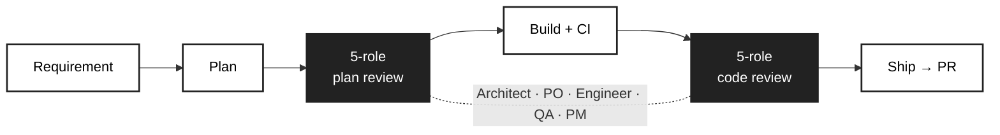

[中文](README.zh-CN.md)

# harness-flow

> **Agent writes code. Harness Flow ships products.**
> — L5 autonomous delivery for the vibe coding era. You're the copilot now.

[](https://www.python.org/)
[](https://pypi.org/project/harness-flow/)
[](LICENSE)

## The Problem

AI agents can write code — but they **can't ship products**. They lack navigation (goal management), traffic rules (quality gates), and a dashcam (audit trail). The bottleneck has shifted from *"can AI write code?"* to *"can AI autonomously deliver?"*

## Where Harness Flow Fits

| Era | Analogy | Human Role | Examples |
|-----|---------|-----------|----------|
| Manual coding | Walking | Write every line | vim + gcc |
| AI assistants | Human driving | Hands on wheel, AI autocompletes | GitHub Copilot |
| Agent mode | L3 self-driving | AI writes but no navigation, no rules, no record | Cursor Agent, Claude Code |
| **Harness Flow** | **L5 self-driving** | **Human as copilot — AI ships autonomously** | **harness-flow** |

### The Three Pillars of L5

- **Navigation** — vision → plan → roadmap: the AI knows *where* to go
- **Traffic Rules** — 5-role parallel review + quality gates + trust boundaries: the AI obeys the rules
- **Dashcam** — full audit trail + cross-session learnings + retrospectives: every decision is recorded

---

## How It Works



One requirement in → one PR out. Both plan and code are reviewed by 5 parallel AI reviewers. Findings from 2+ roles on the same issue are flagged `[HIGH CONFIDENCE]`.

**Fix-First** classifies every review finding:
- **AUTO-FIX** — high certainty + small blast radius + reversible → fixed immediately
- **ASK** — security, behavior change, architecture → batched for your decision

---

## Quick Start

### 0. 10-minute happy path

**Step 1** — Install:

```bash
pip install harness-flow
```

**Step 2** — Initialize in your project:

```bash
cd <YOUR_PROJECT_PATH>
harness init
```

**Step 3** — Open Cursor, type a requirement:

```
/harness-plan add input validation to the user registration endpoint
```

That's it — plan, build, 5-role review, and PR. One command.

**What you'll see:** the agent generates a spec + contract, 5 reviewers challenge the plan in parallel, then the agent implements, runs CI, gets code reviewed by the same 5 roles, and opens a PR — all autonomously.

<!-- TODO: Add a demo recording (GIF or video) showing the full flow from requirement to PR -->

---

## Deep Dive

<details>
<summary><strong>Your AI Engineering Team — 5 parallel reviewers</strong></summary>

Harness gives you a **complete engineering team** inside Cursor — each role reviews both your plan and your code:

| Role | Plan Review | Code Review |
|------|------------|-------------|
| **Architect** | Feasibility, module impact, dependencies | Conformance, layering, coupling, security |
| **Product Owner** | Vision alignment, user value, acceptance criteria | Requirement coverage, behavioral correctness |
| **Engineer** | Implementation feasibility, code reuse, tech debt | Code quality, DRY, patterns, performance |
| **QA** | Test strategy, boundary values, regression risk | Test coverage, edge cases, CI health |
| **Project Manager** | Task decomposition, parallelism, scope | Scope drift, plan completion, delivery risk |

> **Not a simulation** — these roles run as parallel AI subagents with distinct system prompts, each scoring independently. Findings from 2+ roles are flagged as high confidence.

Each role can use a different model via `[native.role_models]` in config. If some reviewers fail, the pipeline continues with available perspectives (graceful degradation).

</details>

<details>
<summary><strong>Contract-Driven Development</strong></summary>

Every task starts with a **spec + contract** — deliverables, acceptance criteria, and risk analysis — reviewed by 5 roles before any code is written.

The contract lives in `.harness-flow/tasks/task-NNN/plan.md` and serves as the single source of truth. Runtime state is tracked in `workflow-state.json` alongside it.

</details>

<details>
<summary><strong>Fix-First Auto-Remediation</strong></summary>

Every review finding is classified before presenting it to you:

- **AUTO-FIX** (high certainty + small blast radius + reversible) → fixed immediately, tests re-run
- **ASK** (security, behavior change, architecture, low confidence) → batched and presented for your decision

Typical auto-fixes: unused imports, stale comments, missing null checks, naming inconsistencies, obvious N+1 queries.

</details>

<details>
<summary><strong>Full Audit Trail</strong></summary>

Plans, reviews, build logs, gate results — all persisted per task. Every decision is traceable.

```
.harness-flow/
├── config.toml              # project settings (CI command, trunk branch, language)
├── vision.md                # product direction (optional)
└── tasks/task-NNN/
    ├── plan.md              # spec + contract (scope SSOT)
    ├── handoff-*.json       # structured context per phase (plan, build, eval, ship)
    ├── build-rN.md          # build log per round
    ├── plan-eval-rN.md      # plan review per round
    ├── code-eval-rN.md      # code review per round
    ├── ship-metrics.json    # delivery metrics (scores, test count, coverage)
    ├── workflow-state.json  # canonical task phase / gate / blocker tracking
    └── ...                  # feedback ledger, intervention audit, etc. (optional)
```

</details>

---

## Installation & Upgrade

| Command | What it does |
|---------|-------------|
| `pip install harness-flow` | Install the CLI |
| `harness init` | Interactive wizard → generates skills, agents, rules into `.cursor/` |
| `harness init --force` | Regenerate all artifacts (after config changes or version upgrade) |
| `harness update` | Self-update the package + run config migration |
| `harness update --check` | Check for new version without installing |

---

## All Skills — default: `/harness-plan`

`/harness-plan` is the default for most tasks — single-round plan → ship path.

`/harness-vision` covers everything from vague ideas to clear directions — it auto-detects whether to explore or clarify.

<details>
<summary><strong>Entry points</strong></summary>

| Skill | When to use | What it does |
|-------|------------|-------------|
| `/harness-plan` | "I have a requirement" | Refine plan + 5-role review → auto build/eval/ship/retro |
| `/harness-vision` | "I have an idea" or "a direction" | Explore or clarify → structured vision → roadmap/backlog → iterative build/eval/ship loop |

</details>

<details>
<summary><strong>Utility & pipeline skills</strong></summary>

| Skill | What it does |
|-------|-------------|
| `/harness-investigate` | Systematic bug investigation: reproduce → hypothesize → verify → minimal fix |
| `/harness-learn` | Memverse knowledge management: store, retrieve, update project learnings |
| `/harness-retro` | Engineering retrospective: commit analytics, hotspot detection, trend tracking |
| `/harness-build` | Implement the contract, run CI, triage failures, write a structured build log |
| `/harness-eval` | 5-role code review (architect + product-owner + engineer + qa + project-manager) |
| `/harness-ship` | Full pipeline: test → review → fix → commit → push → PR |
| `/harness-doc-release` | Documentation sync: detect stale docs after code changes |

</details>

<details>
<summary><strong>Progress & next-step hints</strong></summary>

- **`harness workflow next`** — one machine-readable line for agents/scripts (task id, phase, suggested skill).
- **`harness status`** — Rich panel for humans ("what to do next" in task language).
- **`HARNESS_PROGRESS`** — one-line boundary marker emitted by Cursor skills.

</details>

---

<details>
<summary><strong>Configuration</strong></summary>

Project settings live in `.harness-flow/config.toml`:

| Key | Default | Description |
|-----|---------|-------------|
| `workflow.max_iterations` | 3 | Max review iterations per task |
| `workflow.pass_threshold` | 7.0 | Evaluator pass threshold (1-10) |
| `workflow.auto_merge` | true | Auto-merge branch after pass |
| `native.evaluator_model` | "inherit" | Default model for review roles; falls back to IDE default |
| `native.review_gate` | "eng" | Review gate strictness (`eng` = hard gate, `advisory` = log only) |
| `native.plan_review_gate` | "auto" | Plan review gate (`human` / `ai` / `auto`) |
| `native.role_models.*` | `{}` | Per-role model overrides; falls back to IDE default |
| `workflow.branch_prefix` | "agent" | Task branch prefix |

</details>

<details>
<summary><strong>CLI reference</strong></summary>

| Command | Description |
|---------|-------------|
| `harness init [--name] [--ci] [-y] [--force]` | Initialize project (interactive wizard) |
| `harness status` | Show current task progress |
| `harness gate [--task]` | Check ship-readiness gates |
| `harness update [--check] [--force]` | Self-update + config migration |
| `harness git-preflight [--json]` | Preflight checks (clean tree, branch, worktree) |
| `harness save-eval --task <id> [--kind] [--verdict] ...` | Save evaluation results |
| `harness save-build-log --task <id> [--body]` | Save build log |
| `harness git-prepare-branch --task-key <key>` | Create or resume task branch |
| `harness git-sync-trunk [--json]` | Sync feature branch with trunk |

</details>

---

## Development

`harness init` generates **10 skills**, **5 subagents**, **4 rules** into `.cursor/`. All task state lives under `.harness-flow/` (local-first). See [MIT License](LICENSE).

```bash
pip install -e ".[dev]"
pytest
ruff check src/ tests/
```
