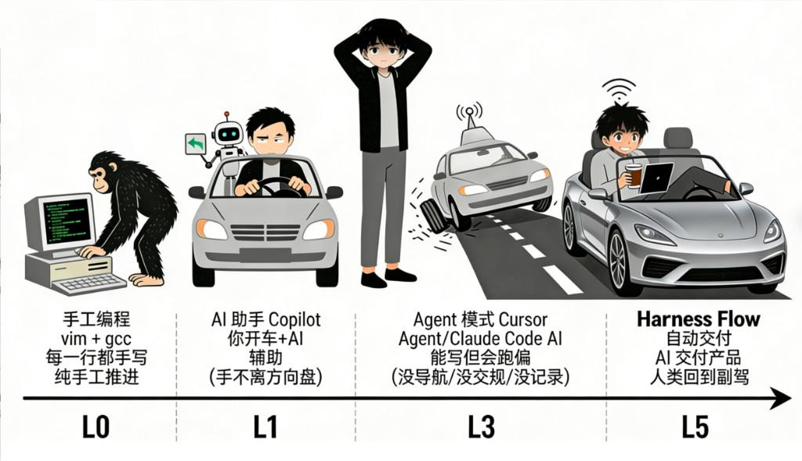
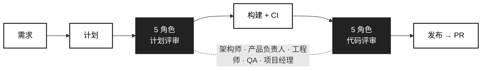

[English](README.md)

<div align="center">

# harness-flow

### Agent 写代码，Harness Flow 交付产品

**vibe coding 的 L5 自动驾驶 — 人类回到副驾**

[](https://www.python.org/)
[](https://pypi.org/project/harness-flow/)
[](LICENSE)

</div>

## 问题

AI Agent 能写代码了——但**不能交付产品**。缺导航（目标管理）、缺交规（质量门禁）、缺行车记录仪（审计与学习）。瓶颈已从 *"AI 能不能写代码"* 升级为 *"AI 能不能自主交付"*。

## Harness Flow 的定位

<p align="center">
  
</p>

### L5 的三大支柱

|  | 导航系统 | 交通规则 | 行车记录仪 |
|--|:------:|:------:|:--------:|
|  | vision → plan → roadmap | 5 角色评审 + 门禁 + 信任边界 | 审计轨迹 + 学习记忆 + 回顾 |
|  | AI 知道**开往哪** | AI 遵守**交通规则** | 每个决策**可追溯** |

---

## 工作原理



一句需求输入 → 一个 PR 输出。计划和代码都经过 5 个并行 AI 评审者审查。2+ 角色标记同一问题时标注 `[HIGH CONFIDENCE]`。

**Fix-First** 在呈现前分类每个评审发现：
- **AUTO-FIX** — 高确定性 + 影响面小 + 可逆 → 立即修复
- **ASK** — 安全、行为变更、架构 → 批量呈现，交由你决策

---

## 快速开始

### 0. 约 10 分钟上手

**第一步** — 安装：

```bash
pip install harness-flow
```

**第二步** — 在项目中初始化：

```bash
cd <YOUR_PROJECT_PATH>
harness init
```

**第三步** — 打开 Cursor，输入需求：

```
/harness-plan 给用户注册接口添加输入验证
```

就这样 — 计划、构建、5 角色评审、PR，一句话搞定。

**你会看到：** agent 生成 spec + 合约，5 个评审者并行挑战计划，然后 agent 实现、跑 CI、再经过 5 角色代码评审、开 PR — 全程自主。

<!-- TODO: 添加 demo 录屏（GIF 或视频），展示从需求到 PR 的完整流程 -->

---

## 深入了解

<details>
<summary><strong>你的 AI 工程团队 — 5 个并行评审者</strong></summary>

Harness 在 Cursor 内为你组建了一支**完整的工程团队** — 每个角色同时评审你的计划和代码：

| 角色 | 计划评审 | 代码评审 |
|------|---------|---------|
| **架构师** | 可行性、模块影响、依赖变更 | 架构合规、分层、耦合、安全 |
| **产品负责人** | vision 对齐、用户价值、验收标准 | 需求覆盖、行为正确性 |
| **工程师** | 实现可行性、代码复用、技术债 | 代码质量、DRY、模式一致、性能 |
| **QA** | 测试策略、边界值、回归风险 | 测试覆盖、边界场景、CI 健康度 |
| **项目经理** | 任务分解、并行度、scope | scope 漂移、计划完成度、交付风险 |

> **不是模拟** — 这些角色作为并行 AI 子代理运行，各自拥有独立系统提示，独立评分。2+ 角色标记同一问题标注为高置信度。

每个角色可通过 `[native.role_models]` 使用不同模型。部分评审者失败时使用可用结果继续（优雅降级）。

</details>

<details>
<summary><strong>契约驱动开发</strong></summary>

每个任务都从 **spec + 合约** 开始 — 包含交付物、验收标准和风险分析 — 经 5 角色审查后才编写代码。

合约保存在 `.harness-flow/tasks/task-NNN/plan.md`，作为唯一事实来源。运行态状态由同目录的 `workflow-state.json` 追踪。

</details>

<details>
<summary><strong>Fix-First 自动修复</strong></summary>

每个评审发现在呈现给你之前都会被分类：

- **AUTO-FIX**（高确定性 + 影响面小 + 可逆）→ 立即修复，重新运行测试
- **ASK**（安全、行为变更、架构、低置信度）→ 批量呈现，交由你决策

典型自动修复：未使用的导入、过时注释、缺失的空值检查、命名不一致、明显的 N+1 查询。

</details>

<details>
<summary><strong>完整审计轨迹</strong></summary>

计划、评审、构建日志、门禁结果 — 按任务持久化。每个决策都可追溯。

```
.harness-flow/
├── config.toml              # 项目配置（CI 命令、主干分支、语言）
├── vision.md                # 产品方向（可选）
└── tasks/task-NNN/
    ├── plan.md              # spec + 合约（范围 SSOT）
    ├── handoff-*.json       # 各阶段结构化上下文（plan、build、eval、ship）
    ├── build-rN.md          # 每轮构建日志
    ├── plan-eval-rN.md      # 每轮计划评审
    ├── code-eval-rN.md      # 每轮代码评审
    ├── ship-metrics.json    # 交付指标（评分、测试数、覆盖率）
    ├── workflow-state.json  # 任务阶段 / 门禁 / 阻塞追踪
    └── ...                  # feedback ledger、intervention audit 等（可选）
```

</details>

---

## 安装与升级

| 命令 | 说明 |
|------|------|
| `pip install harness-flow` | 安装 CLI |
| `harness init` | 交互式向导 → 生成 skills、agents、rules 到 `.cursor/` |
| `harness init --force` | 重新生成所有产物（配置变更或版本升级后使用） |
| `harness update` | 自更新包 + 运行配置迁移 |
| `harness update --check` | 仅检查新版本，不安装 |

---

## 所有技能

**默认（大多数任务）：** `/harness-plan` — 单轮 plan → ship 路径。

`/harness-vision` 涵盖从模糊想法到清晰方向的全部场景——自动判断需要探索还是澄清。

<details>
<summary><strong>入口</strong></summary>

| 技能 | 何时用 | 功能 |
|------|--------|------|
| `/harness-plan` | "我有个需求" | 细化计划 + 5 角色审查 → 自动构建/评审/发布/回顾 |
| `/harness-vision` | "我有个想法"或"我有个方向" | 探索或澄清 → 结构化 vision → roadmap/backlog → 迭代式构建/评审/发布循环 |

</details>

<details>
<summary><strong>工具与管线技能</strong></summary>

| 技能 | 功能 |
|------|------|
| `/harness-investigate` | 系统化 bug 调查：复现 → 假设 → 验证 → 最小修复 |
| `/harness-learn` | Memverse 知识管理：存储、检索、更新项目经验 |
| `/harness-retro` | 工程回顾：提交分析、热点检测、趋势追踪 |
| `/harness-build` | 按契约实现，运行 CI，分流失败，输出结构化构建日志 |
| `/harness-eval` | 5 角色代码评审（架构师 + 产品负责人 + 工程师 + QA + 项目经理） |
| `/harness-ship` | 全自动流水线：测试 → 评审 → 修复 → 提交 → push → PR |
| `/harness-doc-release` | 文档同步：检测代码变更导致的文档过时 |

</details>

<details>
<summary><strong>进度与下一步提示</strong></summary>

- **`harness workflow next`** — 一行机器可读提示（任务、阶段、建议技能）。
- **`harness status`** — Rich 面板，用任务语言说明下一步。
- **`HARNESS_PROGRESS`** — IDE 技能输出的单行进度标记。

</details>

---

<details>
<summary><strong>配置</strong></summary>

项目设置位于 `.harness-flow/config.toml`：

| 键 | 默认值 | 说明 |
|-----|--------|------|
| `workflow.max_iterations` | 3 | 每任务最大评审迭代次数 |
| `workflow.pass_threshold` | 7.0 | 评审通过阈值（1-10） |
| `workflow.auto_merge` | true | 通过后自动合并分支 |
| `native.evaluator_model` | "inherit" | 评审角色默认模型；无效时回退到 IDE 默认 |
| `native.review_gate` | "eng" | 评审门禁（`eng` = 硬门禁，`advisory` = 仅记录） |
| `native.plan_review_gate` | "auto" | 计划审阅门控（`human` / `ai` / `auto`） |
| `native.role_models.*` | `{}` | 每角色模型覆盖；无效时回退到 IDE 默认 |
| `workflow.branch_prefix` | "agent" | 任务分支前缀 |

</details>

<details>
<summary><strong>命令参考</strong></summary>

| 命令 | 说明 |
|------|------|
| `harness init [--name] [--ci] [-y] [--force]` | 初始化项目（交互式向导） |
| `harness status` | 显示当前任务进度 |
| `harness gate [--task]` | 检查发布门禁 |
| `harness update [--check] [--force]` | 自更新 + 配置迁移 |
| `harness git-preflight [--json]` | 预检（工作树、分支、worktree） |
| `harness save-eval --task <id> [--kind] [--verdict] ...` | 保存评审结果 |
| `harness save-build-log --task <id> [--body]` | 保存构建日志 |
| `harness git-prepare-branch --task-key <key>` | 创建或恢复任务分支 |
| `harness git-sync-trunk [--json]` | 同步 feature 分支与主干 |

</details>

---

## 开发

`harness init` 生成 **9 个 skill**、**5 个 subagent**、**4 条 rule** 到 `.cursor/`。所有任务状态存放在 `.harness-flow/`（本地优先）。查看 [MIT License](LICENSE)。

```bash
pip install -e ".[dev]"
pytest
ruff check src/ tests/
```
