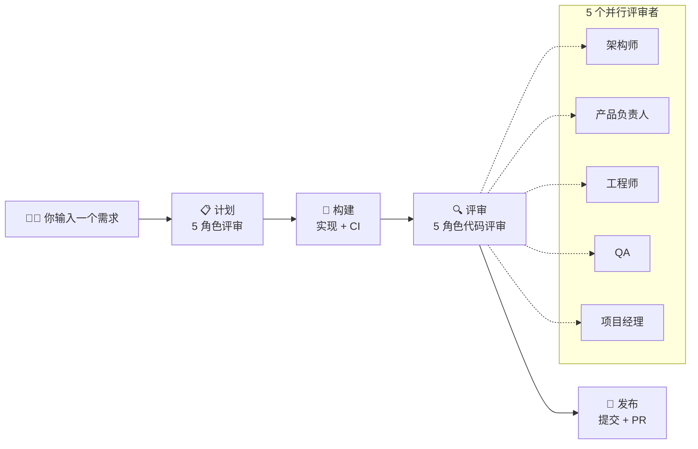

[English](README.md)

# harness-flow

> **Cursor 原生 AI 工程框架** — 在 Cursor 内完成计划、构建、评审、发布，内置结构化质量门禁。

[](https://www.python.org/)
[](https://pypi.org/project/harness-flow/)
[](LICENSE)



---

## 快速开始

### 0. 约 10 分钟上手

```bash
pip install harness-flow
cd /path/to/your/project
harness init
```

然后在 Cursor 中输入：

```
/harness-plan 给用户注册接口添加输入校验
```

就这样。Harness 会自动完成计划、构建、5 角色评审，最终产出一个 PR —— 一句话搞定。

<!-- TODO: 添加 demo 录屏（GIF 或视频），展示从需求到 PR 的完整流程 -->
<!-- TODO: 添加 5 角色评审输出的截图 -->

---

## 工作原理

一句需求输入，一个 PR 输出。内部流程如下：

```
/harness-plan "添加功能 X"
  → 计划：spec + 合约
  → 5 角色并行评审（架构师、产品负责人、工程师、QA、项目经理）
  → 构建：实现 + 测试
  → 评审：5 角色代码评审 + Fix-First 自动修复
  → 发布：可二分提交 + push + PR
```

**Fix-First** 在呈现前分类每个评审发现：
- **AUTO-FIX** — 高确定性、影响面小 → 立即修复
- **ASK** — 安全发现、行为变更、低置信度 → 交由你决策

<details>
<summary><strong>5 角色评审详情</strong>（优雅降级 — 部分评审者失败时使用可用结果继续）</summary>

| 角色 | 计划审查 | 代码评审 |
|------|---------|---------|
| **架构师** | 可行性、模块影响、依赖变更 | 架构合规性、分层、耦合、安全 |
| **产品负责人** | vision 对齐、用户价值、验收标准 | 需求覆盖、行为正确性 |
| **工程师** | 实现可行性、代码复用、技术债 | 代码质量、DRY、模式一致、性能 |
| **QA** | 测试策略、边界值、回归风险 | 测试覆盖、边界场景、CI 健康度 |
| **项目经理** | 任务分解、并行度、scope | scope 漂移、计划完成度、交付风险 |

被 2+ 角色发现的问题标注为**高置信度**。每个角色可通过配置中的 `[native.role_models]` 使用不同模型。

</details>

---

## 所有技能

**默认（大多数任务）：** `/harness-plan` — 任务边界已清楚时的单轮 plan → ship 路径。

<details>
<summary><strong>进阶入口</strong></summary>

需要**长期方向**与 roadmap 循环时用 `/harness-brainstorm`（long-horizon loop）；方向较清楚、先澄清增量 vision 再规划时用 `/harness-vision`；单轮 plan → ship 时用 **`/harness-plan`**（single-round plan）。

| 技能 | 何时用 | 功能 |
|------|--------|------|
| `/harness-brainstorm` | "我有个想法" | 发散探索 → 结构化 vision → roadmap/backlog → 迭代式构建/评审/发布循环 |
| `/harness-vision` | "我有个方向" | 澄清 vision → 计划 → 自动构建/评审/发布/回顾 |
| `/harness-plan` | "我有个需求" | 细化计划 + 5 角色审查 → 自动构建/评审/发布/回顾 |

</details>

<details>
<summary><strong>工具与管线技能</strong></summary>

| 技能 | 功能 |
|------|------|
| `/harness-investigate` | 系统化 bug 调查：复现 → 假设 → 验证 → 最小修复 |
| `/harness-learn` | Memverse 知识管理：存储、检索、更新项目经验 |
| `/harness-retro` | 工程回顾：提交分析、热点检测、趋势追踪 |
| `/harness-build` | 按契约实现，运行 CI，分流失败，输出结构化构建日志 |
| `/harness-eval` | 5 角色代码评审（架构师 + 产品负责人 + 工程师 + QA + 项目经理） |
| `/harness-ship` | 全自动流水线：测试 → 评审 → 修复 → 提交 → push → PR |
| `/harness-doc-release` | 文档同步：检测代码变更导致的文档过时 |

</details>

<details>
<summary><strong>进度与下一步提示</strong></summary>

- **`harness workflow next`** — 一行机器可读提示（任务、阶段、建议技能）。
- **`harness status`** — Rich 面板，用任务语言说明下一步。
- **`HARNESS_PROGRESS`** — IDE 技能输出的单行进度标记。

</details>

---

<details>
<summary><strong>配置</strong></summary>

项目设置位于 `.harness-flow/config.toml`：

| 键 | 默认值 | 说明 |
|-----|--------|------|
| `workflow.max_iterations` | 3 | 每任务最大评审迭代次数 |
| `workflow.pass_threshold` | 7.0 | 评审通过阈值（1-10） |
| `workflow.auto_merge` | true | 通过后自动合并分支 |
| `workflow.branch_prefix` | "agent" | 任务分支前缀 |
| `native.evaluator_model` | "inherit" | 评审角色默认模型；无效时回退到 IDE 默认 |
| `native.review_gate` | "eng" | 评审门禁（`eng` = 硬门禁，`advisory` = 仅记录） |
| `native.plan_review_gate` | "auto" | 计划审阅门控（`human` / `ai` / `auto`） |
| `native.role_models.*` | `{}` | 每角色模型覆盖 |

</details>

<details>
<summary><strong>命令参考</strong></summary>

| 命令 | 说明 |
|------|------|
| `harness init [--name] [--ci] [-y] [--force]` | 初始化项目（交互式向导） |
| `harness status` | 显示当前任务进度 |
| `harness gate [--task]` | 检查发布门禁 |
| `harness update [--check] [--force]` | 自更新 + 配置迁移 |
| `harness git-preflight [--json]` | 预检（工作树、分支、worktree） |
| `harness git-prepare-branch --task-key <key>` | 创建或恢复任务分支 |
| `harness git-sync-trunk [--json]` | 同步 feature 分支与主干 |
| `harness save-eval --task <id> [--kind] [--verdict] ...` | 保存评审结果 |
| `harness save-build-log --task <id> [--body]` | 保存构建日志 |

</details>

---

## 开发

`harness init` 生成 **10 个 skill**、**5 个 subagent**、**4 条 rule** 到 `.cursor/`。所有任务状态存放在 `.harness-flow/`（本地优先）。查看 [MIT License](LICENSE)。

```bash
pip install -e ".[dev]"
pytest
ruff check src/ tests/
```
